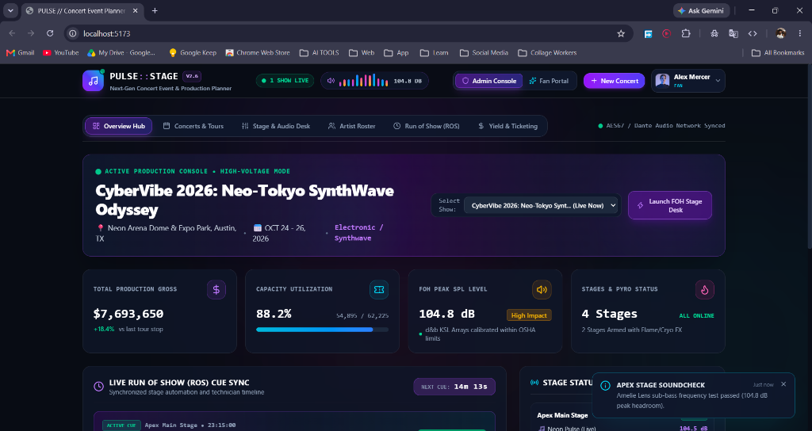
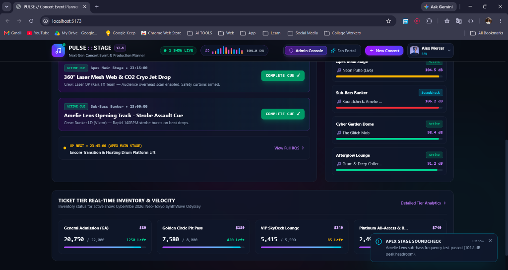
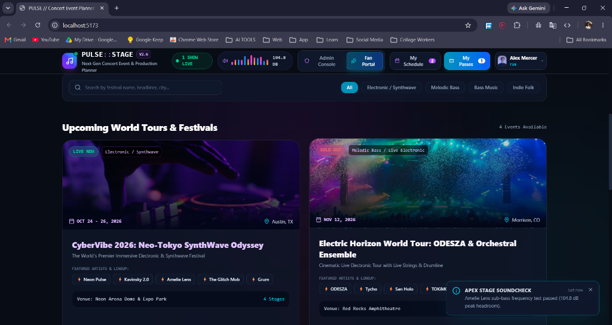
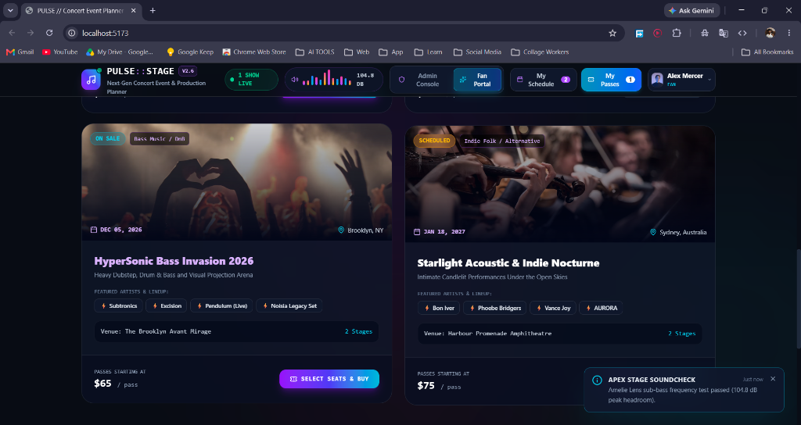

# Pulse Concert Planner

Pulse is a dark-mode concert production and ticketing experience designed for event teams and fans. The interface blends a live control-room dashboard with a modern ticket discovery experience, allowing users to browse upcoming shows, manage schedules, monitor production status, and purchase event passes.

## What this app includes

- Admin production console for managing live events and logistics
- Fan-facing concert discovery and ticket marketplace
- Event schedule planner and personal booking dashboard
- Digital ticket and purchase flow
- Animated dark UI styled like a premium music-tech control panel
- Mock event data for festival, EDM, and live concert experiences

## Screenshots

### 1. Admin Production Console & Live Metrics


### 2. Live Run of Show (ROS) Cues & Ticket Inventory


### 3. Fan Portal — World Tours & Festival Discovery


### 4. Fan Portal — Lineup Exploration & Pass Booking


### UI highlights

- Production overview with live event metrics
- Fan portal for upcoming tours and festivals
- My schedule and my passes workspace
- Event cards with venue, lineup, pricing, and stage status

## Getting Started

1. Install dependencies:

   ```bash
   npm install
   ```

2. Start the app locally:

   ```bash
   npm run dev
   ```

3. Open the local Vite URL displayed in the terminal.

## Production build

```bash
npm run build
```

## Project structure

- `src/components/admin` — admin dashboard and event tools
- `src/components/user` — fan portal, schedule, and ticketing views
- `src/components/shared` — reusable navigation, notifications, and layout helpers
- `src/context` — app state management and shared event data
- `src/data` — mock concert and venue data

## Tech stack

- React
- Vite
- Tailwind CSS
- Framer Motion
- Lucide React

## Notes

This project is built as a polished frontend prototype and is intended to showcase a concert planning experience with a dramatic, futuristic visual style.
